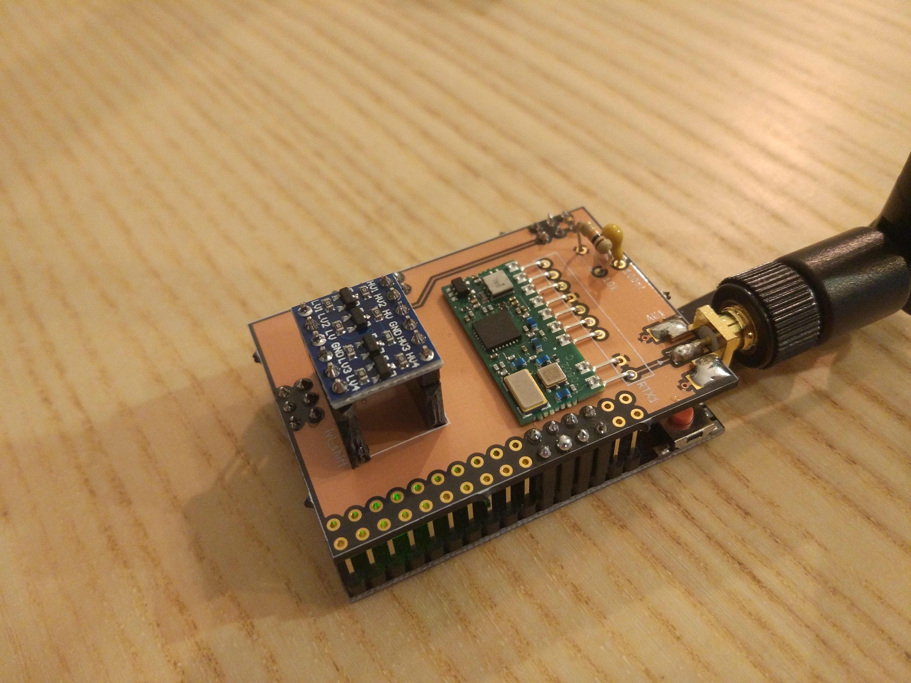

In this blog post I would like to share my custom RFLink gateway built on top of the [RobotDyn Mega 2560 PRO](https://robotdyn.com/catalog/arduino/boards/matrix-led-8x8-module-32x32mm-driver-max7219-7221.html) board. You can see the Mega 2560 PRO as an Arduino Mega clone using a more efficient board layout in order to achieve a smaller board size while still exposing all the relevant features of the microcontroller.

I designed a daughter board using KiCAD with the instructions from the [RFLink website](http://www.rflink.nl/blog2/wiring) in order to place the RF parts. I used the Aurel RTX MID 5v transceiver which is recommended by the RFLink team. The fact that it contains receiver and transmitter on the same board simplifies the wiring and enables you to use only one antenna. You could however use any other 433 Mhz RF TX/RX components as described on the site.

Here is the full component list for this project:

- MEGA 2560 PRO Board

- Custom PCB

- 100nF ceramic capacitor

- 10k resistor
- Bi-directional logic level converter

- SMA edge connector

- 433 Mhz SMA antenna

The MEGA 2560 PRO board uses 3.3V logic levels internally and is not compatible with 5V logic, even though it is powered from 5V USB. It has an on-board LDO converter which provides 3.3V. This means it is not possible to directly hook up the Aurel RTX MID 5v transceiver which works on 5V. I added a [bi-directional logic level converter](https://www.sparkfun.com/products/12009) to the design for this reason, in order to be able to get the devices to talk to each other. When looking around on the Internet, I saw that there is actually a 3.3V version of the Aurel RTX MID (called Aurel RTX MID 3v), which you could hook up directly. However, the 3.3V version appears to be even more difficult to find from resellers than the 5V version, so I went with the 5V version.

In order to program the Mega board, I used an AVR programmer. I went for the [AVRISP mkII](https://www.microchip.com/DevelopmentTools/ProductDetails/PartNO/ATAVRISP2). I don't think this should be necessary since the board should come preflashed with the Arduino bootloader and you should be able to flash it directly over USB. Mine did not have an Arduino bootloader but this can be due to the fact that I tinkered with it in the past.

You need to download the [RFLink firmware](http://www.rflink.nl/blog2/download) and extract the RFLink.cpp.hex file which contains the actual binary firmware. (Note that RFLink is not an open source project. The source code for the firmware is not available. They do provide the source code for an old version of the firmware though).

After you extracted the firmware, you can flash it directly over USB using the following command:

> avrdude -p atmega2560 -c stk500v2 -P **/dev/ttyUSBx** -b 115200 -D -Uflash:w:**/path/to/**RFLink.cpp.hex:i   

or you can use the AVRISP mkII programmer using this command:

> avrdude -p atmega2560 -c avrispmkII -D -U flash:w:RFLink.cpp.hex:i

If you run on Windows, you can also use the GUI tool provided in the firmware archive.

My KiCAD project for the daughter board is available here : https://framagit.org/jaj/rflink-gateway.

You can order the PCB directly from OSH Park here: https://oshpark.com/shared_projects/cp3NoWn5.

Most parts and devices listed above can be found very cheap from Chinese resellers.

After you completed the board, it is possible to hook it up to home automation software over USB. At my place, I use it together with [Home Assistant](https://www.home-assistant.io/integrations/rflink/) and a Raspberry Pi in order to control smart sockets.

Here is a view of the fully assembled board. Maybe at some point I will design a box for it.

Links:

- [https://robotdyn.com/catalog/arduino/boards/matrix-led-8x8-module-32x32mm-driver-max7219-7221.html](https://robotdyn.com/catalog/arduino/boards/matrix-led-8x8-module-32x32mm-driver-max7219-7221.html)

- [http://www.rflink.nl/blog2/wiring](http://www.rflink.nl/blog2/wiring)

- [https://www.sparkfun.com/products/12009](https://www.sparkfun.com/products/12009)

- [https://oshpark.com/shared_projects/cp3NoWn5](https://oshpark.com/shared_projects/cp3NoWn5)

- [https://framagit.org/jaj/rflink-gateway](https://framagit.org/jaj/rflink-gateway)

