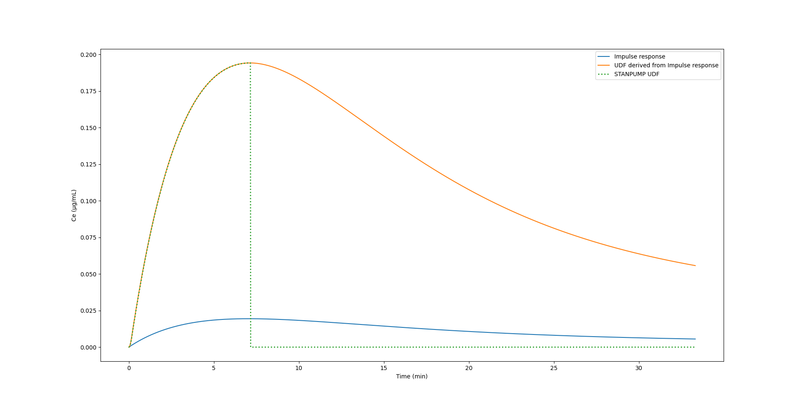
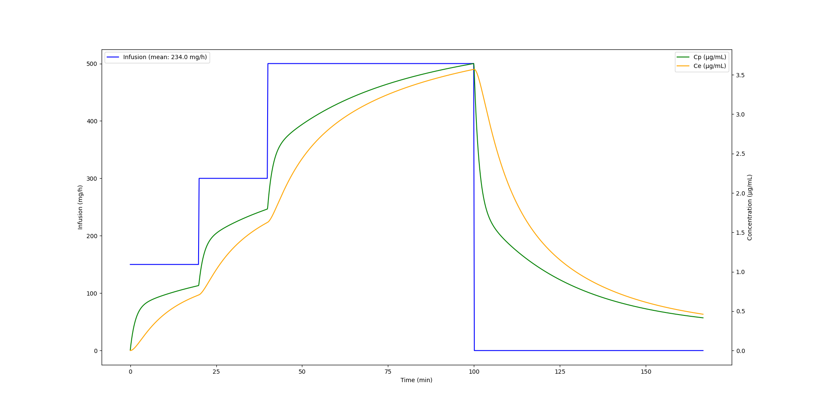
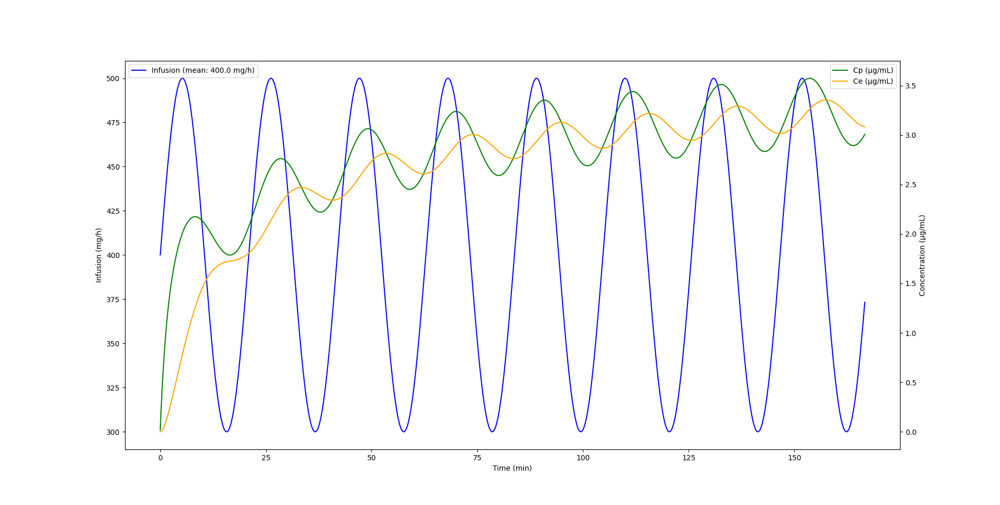
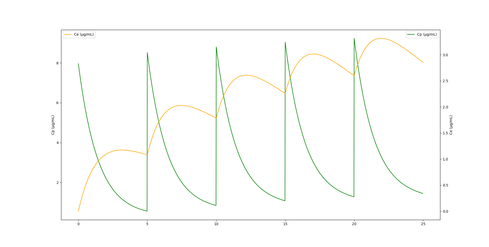

## Eigendecomposition reveals itself

I recently read the excellent [document written by Charles Minto](https://www.dropbox.com/scl/fi/t1ko4w537ompfbilmrenc/uptopcoef-260220.pdf?rlkey=dvkc6klze46zye1gif17p5tyh) titled "From Eigenvalues to Plasma Coefficients".
In this document, Charles explains how to derive STANPUMP’s plasma coefficient using the Laplace transform of the PK system matrix.

The derivation was previously published by Shafer and Gregg @shafer_algorithms_1992 but I found it difficult to follow the derivation of the coefficients themselves, especially the step of partial fraction decomposition.

After some more background reading and on the second reading, I realized that this is equivalent to a standard technique called **Eigendecomposition**! This struck me as a "Eureka" moment because I like generalizing algorithms and finding common approaches across disciplines. This missing link unifies pharmacometrics, linear algebra, control theory and state space modeling. It shows that TCI is indeed rocket science because the algorithms are very close to the ones used to send Apollo spacecrafts to the moon.

PK systems are transformations which transform infusion rates into plasma and effect side compartment concentrations. The common PK systems we work with are linear transformation, which is a very important characteristic without which all of our derivations are not valid. Linear transformations can be characterized by two determinants which are the **eigenvalues** and the **eigenvectors**.

It can be difficult to grasp how eigenvalues and eigenvectors determine linear transformations. I find [this video](https://www.youtube.com/watch?v=ue3yoeZvt8E) helpful to get some intuition on how it works.

We already know the eigenvalues from previous blog posts, they are the macro (hybrid) rate constants $\lambda$. The eigenvectors are the key to derive the coefficients which link the PK system to infusion. They allow external input to enter the model.


## The PK system matrix

For a 3-compartment PK model with effect compartment, the ODE system is usually written as in @eq-ode.

$$
\begin{aligned}
\frac{dA_1}{dt} &= - \left(k_{12} + k_{13} + k_{10}\right) A_1 + k_{21} A_2 + k_{31} A_3 + j(t), \\
\frac{dA_2}{dt} &= k_{12} A_1 - k_{21} A_2, \\
\frac{dA_3}{dt} &= k_{13} A_1 - k_{31} A_3, \\
\frac{dC_e}{dt} &= k_{e0} \left( \frac{A_1}{V_1} - C_e \right).
\end{aligned}
$$ {#eq-ode}

However, the dimensions of this system are not homogeneous. Indeed, for compartments 1-3, the ODEs refer to the drug quantity (usually expressed in mg) whereas the effect compartment is expressed as a concentration (mg/L). We need to unify dimensions for eigendecomposition. We can choose to convert all equations to mass or concentration. Converting to mass raises a problem for the effect site compartment since the volume and mass are usually unknown. For this reason, it is easier and elegant to convert all equations to concentration by dividing each compartment equation by its volume as seen in @eq-ode-conc.

$$
\begin{aligned}
\frac{dC_1}{dt} &= - \left(k_{12} + k_{13} + k_{10}\right) C_1 + k_{21} C_2 \frac{V_2}{V_1} + k_{31} C_3 \frac{V_3}{V_1} + \frac{j(t)}{V_1}, \\
\frac{dC_2}{dt} &= k_{12} C_1 \frac{V_1}{V_2} - k_{21} C_2, \\
\frac{dC_3}{dt} &= k_{13} C_1 \frac{V_1}{V_3} - k_{31} C_3, \\
\frac{dC_e}{dt} &= k_{e0} C_1 - k_{e0} C_e
\end{aligned}
$$ {#eq-ode-conc}

Given that $k_{ij} \frac{V_i}{V_j} = k_{ji}$, this expression can be simplified to the elegant @eq-ode-conc-simp.

$$
\begin{aligned}
\frac{dC_1}{dt} &= - \left(k_{12} + k_{13} + k_{10}\right) C_1 + k_{12} C_2 + k_{13} C_3 + \frac{j(t)}{V_1}, \\
\frac{dC_2}{dt} &= k_{21} C_1 - k_{21} C_2, \\
\frac{dC_3}{dt} &= k_{31} C_1 - k_{31} C_3, \\
\frac{dC_e}{dt} &= k_{e0} C_1 - k_{e0} C_e
\end{aligned}
$$ {#eq-ode-conc-simp}

@eq-ode-conc-simp can be written in matrix form as follows:

$$
\frac{dC}{dt} = A C + J
$$

$$
A = \begin{pmatrix}
-(k12 + k13  + k10) & k12 & k13 & 0 \\
k21 & -k21 & 0 & 0 \\
k31 & 0 & -k31 & 0 \\
ke0 & 0 & 0 & -ke0 \\
\end{pmatrix},
J = \begin{pmatrix}
\frac{j}{V} \\
0 \\
0 \\
0 \\
\end{pmatrix}
$$

## The PK system matrix

Once we defined the system matrix, we can leverage standard libraries for eigenvalue decomposition. For example numpy provides *np.linalg.eig* which directly returns eigenvalues and eigenvectors given a matrix. This numpy function does all the heavy lifting.

However, the returned eigenvalue/eigenvector pairs are not sorted. Eigenvalues have no concept of sorting, this is an additional structure that we impose. STANPUMP also needs to sort eigenvalues which it obtains using Viète's trigonometric method. Our sorting code is a little bit more complicated because we generalize the maths. We need to extract the effect compartment eigenvalue (ke0), sort the PK eigenvalues, put everything back together and keep track of the ordering because we need to sort eigenvalues and eigenvectors in the same fashion since they go in pairs.

In theory, eigendecomposition can go wrong if the matrix is malformed. I do not think that this is possible for PK systems but it is nevertheless easy to check if the eigendecomposition worked as expected. You can reconstruct the system matrix from the eigenvalue / eigenvector pairs and compare to see if they match. This is done in this function, which will fail if the reconstructed system matrix does not match the original one.

Once, we have the eigenvalue / eigenvector pairs, we can obtain the model **step response coefficients**. The coefficients characterize the system response, which is the response to a unit infusion. The step response shows how the system responds to an excitation, it shows how plasma / effect site concentration dynamics are driven by the drug.

You can click the code cell below to expand the function definition.

```{python}
#| eval: false
#| code-fold: true
#| code-summary: "Show eigendecomposition function definition"
def eigendecomposition(k10, k12, k13, k21, k31, V1, ke0):
    # System matrix
    k123 = k10 + k12 + k13
    A = np.array(
        [
            [-k123,  k12,  k13,    0],
            [  k21, -k21,    0,    0],
            [  k31,    0, -k31,    0],
            [  ke0,    0,    0, -ke0],
        ]
    )

    # Eigenvalue decomposition
    eigvals, eigvecs = np.linalg.eig(A)

    # Sort by magnitude (most negative first)
    sort_idx = np.argsort(eigvals)
    eigvals = eigvals[sort_idx]
    eigvecs = eigvecs[:, sort_idx]

    # lambda_i are positive (decay constants)
    lambdas = -eigvals

    # Find ke0 index
    ke0_idx = np.argmin(np.abs(lambdas - ke0))

    # Create mask to separate PK eigenvalues from ke0
    pk_mask = np.ones_like(lambdas, dtype=bool)
    pk_mask[ke0_idx] = False

    # Reconstruct in STANPUMP order: [λ1_pk, λ2_pk, λ3_pk, ke0]
    lambdas = np.append(
        lambdas[pk_mask],
        lambdas[ke0_idx],
    )
    eigvecs = np.column_stack(
        [
            eigvecs[:, pk_mask],
            eigvecs[:, ke0_idx],
        ]
    )

    # A can be reconstructed from eigenvalues and eigenvectors
    A_reconstructed = eigvecs @ np.diag(-lambdas) @ np.linalg.inv(eigvecs)
    assert np.allclose(A, A_reconstructed)

    # Initial condition for unit bolus in central compartment
    C0 = np.array([1.0 / V1, 0.0, 0.0, 0.0])  # µg/L

    # Modal coordinates
    alpha = np.linalg.inv(eigvecs) @ C0  # µg/L

    # Plasma coefficients (row 0 = Cp)
    p_coef = eigvecs[0, :] * alpha / lambdas  # sec/L

    # Effect site coefficients (row 3 = Ce)
    e_coef = eigvecs[3, :] * alpha / lambdas  # sec/L

    return lambdas, p_coef, e_coef
```

This function can be used like below to calculate the lambda values and coefficients in one pass.

```{python}
#| eval: false
lambdas, p_coef, e_coef = eigendecomposition(
    p.k10, p.k12, p.k13,
    p.k21, p.k31, p.vc, p.ke0,
)
```

This function return coefficient for the plasma compartment and effect site compartment. More generally, a matrix $M$ can be calculated which contains all the coefficients for all the compartments. This matrix is defined as $M = V \cdot \text{diag}\left(\frac{\boldsymbol{\alpha}}{\boldsymbol{\lambda}}\right)$, or in code `M = eigvecs @ np.diag(alpha / lambdas)`.
This modal-compartmental coefficient matrix connects the macro rate constants `lambda` with the compartments.
Each row corresponds to a compartment and each column corresponds to a mode.
The compartments stand for the spatial relationships (volume) and the modes to the temporal relationships (fast / slow dynamics).
Modes come from state-space model theory. Indeed, PK systems are state-space models as well.
In the above function, we extract and return coefficients for the central and effect site compartments but we could extract them for all compartments.

These values are identical to the ones calculated using the Laplace technique and they can be used as-is in the TCI algorithm. Using the Laplace domain transfer function approach, the coefficients emerge from the partial fraction decomposition of the residues.

The key insight is that this method gives closed form solutions for any linear PKPD model. It can be applied for 1, 2 and 3 compartment models with or without effect site, with or without depot compartment and can be used with models of arbitrary number of compartments for example transit compartment models. The method can be used to fit the PKPD models (as implemented by NONMEM in the ADVAN5 and ADVAN7 routines) and for TCI. Using this technique, it is not necessary to painstakingly derive closed form solutions for particular systems.

Once you calculated the lambdas and coefficients, you can use the regular STANPUMP algorithm and the model update function below to calculate concentrations for a given compartment over time. Here, $A$ is the initial state for each mode and the function returns the new state. This is an *ADVANcer* in the NONMEM sense. $A$ is a vector and the compartment concentration is the sum of the vector.

```{python}
#| eval: false
def model(A, lambdas, coefs, rate, dt):
    """
    Update compartment amounts after infusion at given rate for time dt.
    
    This is the discrete-time solution:
    A(t+dt) = A(t)·exp(-λ·dt) + c·rate·(1 - exp(-λ·dt))
    """
    decay = np.exp(-lambdas * dt)
    return A * decay + coefs * rate * (1 - decay)
```

## Impulse response and UDF

The coefficients together with the lambda values define the model step response which on its own defines the entire dynamics of the model. The **impulse response** coefficients can be obtained by multiplying the coefficients with the lambda values.

Using the well known modal closed form solution of the 3-compartment model @eq-threecomp, we can calculate the time response of a PK model given an input infusion or bolus.

$$
\text{Conc}(t) = A e^{-\alpha t} + B e^{-\beta t} + C e^{-\gamma t}
$$ {#eq-threecomp}


```{python}
#| eval: false
def calculate_impulse_response(lambdas, coefs, t):
    A_imp = coefs * lambdas  # [L^-1]
    decay = np.exp(-lambdas[:, np.newaxis] * t[np.newaxis, :])
    return np.sum(A_imp[:, np.newaxis] * decay, axis=0)
```

This impulse response is very special because it can derive the response to any infusion. It can be used to calculate the UDF. Indeed, in the code below, we define a unit infusion for `delta_seconds` which is defined as 10 seconds (called `pulse` below). The UDF is the result of a **convolution** of this unit infusion with the impulse response as shown in @fig-udf.

```{python}
#| eval: false
n_points = 2000
pulse = np.zeros(n_points)
pulse[0:delta_seconds] = 1

t = np.arange(n_points)
uir = calculate_impulse_response(lambdas, e_coef, t)
udf = np.convolve(uir, pulse, mode="full")
```

{#fig-udf}

## Generalized model response through convolution

However, we are not limited to calculating the UDF this way. Convolution with the impulse response yields the model response for any input. This technique is called Duhamel's superposition integral. @fig-infu_regular shows the plasma and effect site concentrations obtained from a Propofol infusion starting initially at 150 mg/h then at 20 minutes increased to 300 mg/h, then at 40 minutes increased to 500 mg/h and finally stopped at 100 minutes.

{#fig-infu_regular}

Using the impulse response convolution, we are not limited to constant or piecewise constant infusion. Let's imagine, a new crazy syringe pump driver hits the market which uses a sinus infusion pattern. @fig-infu_sinus shows an infusion which oscillates between 300 and 500 mg/h Propofol infusion in a sinus pattern. We can just as easily calculate the plasma and effect site concentrations of this non linear infusion.

{#fig-infu_sinus}

Finally, the impulse response coefficients can also easily accommodate bolus administration. @fig-bolus shows plasma and effect site concentration of a typical simulated individual which receives a Propofol bolus of 50mg every 5 minutes for 25 minutes.

{#fig-bolus}

## Final thoughts

Anaesthesia is rocket science. Carrying out general anaesthesia is similar to controlling a spacecraft through a turbulent atmosphere. While some prefer to fly manually, modern control algorithms allow optimal flight paths and allow to land the rocket for reuse. The insight that PKPD systems and TCI behave like state space models in physics allows us to generalize our knowledge of these systems, ease calculations and widen potential applications.

## References
::: {#refs}
:::