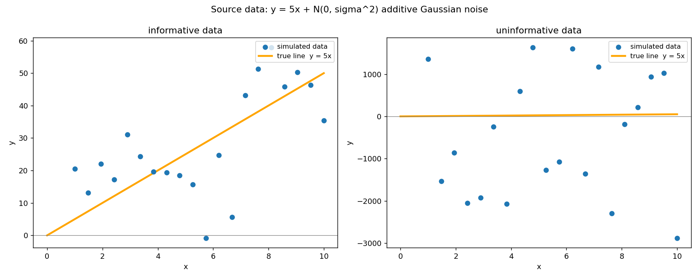
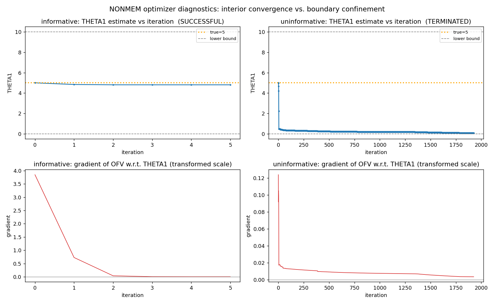
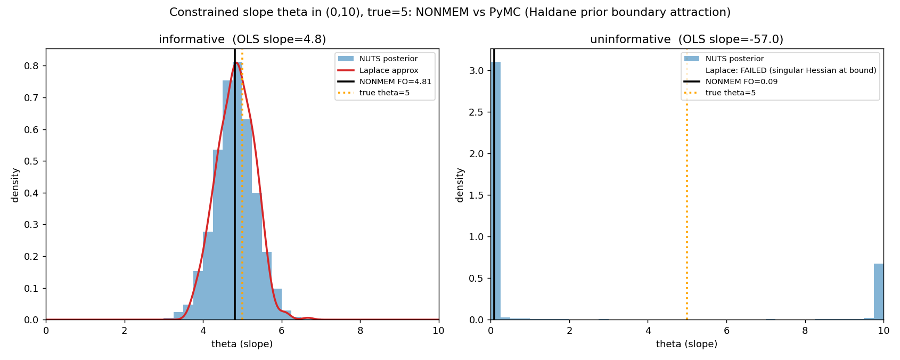
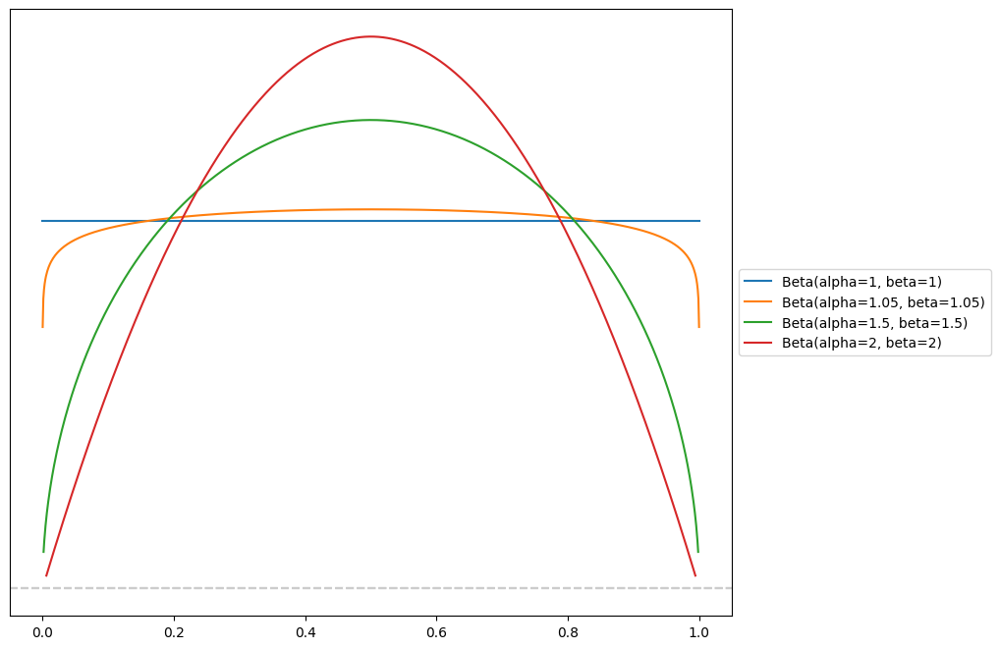

## Constrained parameter optimization {#sec-transform}

Many optimisation software fit parameters on an infinite scale. If a bounded
parameter needs to be optimised, this is achieved using a non-linear
transformation which maps the infinite domain onto the constrained domain,
usually by means of a sigmoid transform such as the logistic function.

If we consider NONMEM as an example, a constrained parameter $\theta$ is defined like this:

```fortran
$THETA  (0, 5, 10)   ; slope: lower 0, init 5, upper 10
```

When you give $\theta$ bounds, NONMEM does not optimise the parameter
directly.  It optimises an *unconstrained* internal variable $u \in (-\infty,
\infty)$ and maps it into the interval through a logistic transform:

$$
\theta = L + (U - L)\,\operatorname{sigmoid}(u),
\qquad
\operatorname{sigmoid}(u) = \frac{1}{1 + e^{-u}}.
$$ {#eq-transform}

In @eq-transform, L and U stand for the lower and upper bounds respectively.

For a gradient based optimiser such as used by NONMEM, the derivative of the parameter becomes:

$$
\frac{\partial \theta}{\partial u} = (U-L)\,\operatorname{sigmoid}(u)\bigl(1-\operatorname{sigmoid}(u)\bigr).
$$

As $\theta$ approaches either bound, $u \to \pm\infty$ and
$\operatorname{sigmoid}(u) \to 0$ or $1$.  The gradient *vanishes* to 0 and the
optimiser gets stuck at the border.

This phenomenon happens every time the optimiser approaches the edges regardless
of what the data say. Any time the optimiser drifts toward a bound, it sees a
flattening objective and tends to get stuck there.

## Wearing the Bayesian costume {#sec-derivation}

Algorithms based on maximum likelihood estimation (MLE) and variations of MLE
implicitly carry a flat uniform prior. This flat prior has a constant
probability density $f_U(u) = c$, $c$ being an arbitrary constant. This means
that the probability for the unconstrained parameter $u$ to take any value from
$-\infty$ to $\infty$ is the same.

However, a flat prior on $u$ is not a flat prior on $\theta$. To see what it
actually is, we push it through the sigmoid transform with a change of
variables.

We operate a change of variables to get rid of the bounds $L$ and $U$. For this
reason, we introduce $p = (\theta - L)/(U - L)$ and obtain $p =
\operatorname{sigmoid}(u)$.

To obtain the probability density of the transformed space, we multiply the
probability density of the untransformed variable with the derivative (Jacobian)
of the transformation.
$$f_P(p) = f_U\bigl(u(p)\bigr)\frac{du}{dp}$$ {#eq-jacobian}

Given that $p = \operatorname{sigmoid}(u)$, $u$ can be calculated as the inverse
of the sigmoid of $p$, which is the logit function:

$$
u = \operatorname{logit}(p) = \log\frac{p}{1-p} = \log p - \log(1-p)
$$.

Now the derivative term $\frac{du}{dp}$ becomes:

$$
\frac{du}{dp} = \frac{1}{p} + \frac{1}{1-p}
= \frac{(1-p) + p}{p(1-p)} = \frac{1}{p(1-p)}.
$$

If we expand this $\frac{du}{dp}$ term into @eq-jacobian, we obtain the full expression

$$
f_P(p) = f_U\bigl(u(p)\bigr)\frac{du}{dp} = \frac{c}{p(1-p)}.
$$ {#eq-haldane}

This has the shape of a [Beta distribution](https://en.wikipedia.org/wiki/Beta_distribution), which has the general form

$$
Beta(\alpha, \beta) = x^{\alpha - 1}(1-x)^{\beta - 1} c
$$

We can thus see that the sigmoid transform on the flat prior induces a $Beta(0,0)$ prior in constrained space. $Beta(0,0)$ is called the **Haldane prior**.

Both the flat distribution and the Haldane distribution are called *improper*
distributions or *improper priors*. Indeed, a *proper* distribution (such as the
Normal distribution) needs to integrate to 1. This is not the case for the flat
prior and the Haldane prior which integrate to $\infty$.

The probability density of the Haldane prior is illustrated in @fig-haldane. It
has a flat probability near the middle of the interval but *infinite*
probability at the borders. Intuitively, we can think of it this way: the flat
prior with a domain of $(-\infty, \infty)$ is squeezed into the finite interval,
so the borders have to accommodate for the infinite probability density at each
side.

{#fig-haldane}

## The flat prior that wasn't

Back in @sec-transform, we derived the gradient of the transformed parameter as
$\frac{\partial \theta}{\partial u} = (U-L)\,\operatorname{sigmoid}(u)\bigl(1-\operatorname{sigmoid}(u)\bigr)$, the inverse of which is $\frac{du}{dp} = \frac{1}{p(1-p)}$

The vanishing edge-gradient of @sec-transform and the boundary mass-spikes of
@eq-haldane are due to the same expression (Jacobian) $1/(p(1-p))$, seen from
two sides. Optimisation sees a derivative that dies at the edge and integration
sees a density that explodes.

Inside the bounded `$THETA`, NONMEM is carrying an *implicit prior*, and not a
gentle one. The *Haldane prior* puts infinite mass spikes at both ends of the
interval.

When the data are informative, the prior is invisible and harmless. However,
when the data are weak, that same prior becomes strong relative to the weak
likelihood and drags estimates to a boundary.

Adding a sigmoid transform to an unbounded parameter in order to turn it into a
bounded one can be seen as a form of prior engineering. However, the resulting
prior is probably not the one you would have chosen if you had been given the
choice.

## Why it only bites under weak data {#sec-bvm}

The [Bernstein–von Mises
theorem](https://en.wikipedia.org/wiki/Bernstein%E2%80%93von_Mises_theorem)
states that, with enough informative data and away from the boundary, the
posterior of a Bayesian inference converges to a Gaussian centred at the MLE
with inverse-Fisher covariance. This means that, under sane conditions, MLE and
Bayesian inference yield the same results.

It is well known that, if the data is informative, the likelihood imposes itself
over the prior and the choice of prior becomes irrelevant in the final result
(posterior). However, under pathological conditions, this no longer holds. If
the data is non-informative or weakly informative, the prior strongly influences
the result.

## A simulation

As an illustration, I ran a simulation. The model is a simple linear regression
with a single parameter (slope).

The slope is constrained to $(0, 10)$ and the true value $\theta = 5$ sits at
the interval midpoint.

Twenty points were sampled with random noise. In one scenario, a random noise
with a variance of 0.5 was added (informative data) and in the other scenario,
the variance was increased to 50 (uninformative data). The resulting datasets
can be seen in @fig-data.

The two resulting datasets were analysed with NONMEM using FOCEI and PyMC using
Hamiltonian Monte Carlo (NUTS).

{#fig-data}

### NONMEM: the optimiser slides to the bound

The NONMEM model is about as simple as it gets. The results for both datasets is seen in @tbl-nonmem.

```fortran
$PRED
  Y = THETA(1)*X + ERR(1)
$THETA  (0, 5, 10)        ; init = true = 5
$SIGMA  80                ; additive residual variance, estimated
$ESTIMATION MAXEVAL=9999 NOABORT SIGDIGITS=3
$COVARIANCE UNCONDITIONAL
```

| Dataset       | $\hat\theta$ |    SE |  RSE | Status                  | #evals |
| ------------- | -----------: | ----: | ---: | ----------------------- | -----: |
| informative   |        4.808 | 0.474 |  10% | MINIMIZATION SUCCESSFUL |     21 |
| uninformative |        0.094 | 0.082 |  87% | MINIMIZATION TERMINATED |  10004 |

: Summary of the NONMEM runs on both datasets {#tbl-nonmem}

The informative fit converges in 21 evaluations to the interior truth. The uninformative
fit dives to the lower bound within ~10 iterations, and gets stuck there until MAXEVAL kicks in.
The transformed-scale gradient stays pinned at a tiny scale the whole way, the vanishing gradient of
@sec-transform.

@fig-nonmem-diag shows both runs iteration by iteration. The informative
optimiser settles at the interior truth in a handful of steps with a gradient
that starts at $3.8$ and decays to zero. With the uninformative dataset, the
optimiser plunges to the lower bound, even though the parameter was initialised
at the true value.

::: {.callout-note}
## Other failure mode

NONMEM has another failure mode with non-informative data when the gradients are
around zero at the initial iteration, so when the likelihood is completely flat
around the starting point. In this case, it will stop and error out immediately
because the optimiser has nowhere to go.
:::

{#fig-nonmem-diag}

### PyMC: the posterior piles at the edge

The PyMC model samples $p$ directly from an approximate Haldane distribution.
PyMC will not allow to specify a $Beta(0,0)$ distribution, since the infinite
spikes at the borders correspond to Dirac delta functions which are hard to
represent. Instead, a $Beta(0.01,0.01)$ distribution is sampled as an
approximation.

```python
eps   = 0.01
p     = pm.Beta("p", eps, eps)              # logit scale == NONMEM's unconstrained u
theta = pm.Deterministic("theta", L + (U - L) * p)
sigma = pm.HalfNormal("sigma", 20)
pm.Normal("y", mu=theta * x, sigma=sigma, observed=y)
```

{#fig-comparison}

For the informative dataset, everything agrees: NUTS $\theta \approx 4.81$,
credible interval $\approx [3.8, 5.8]$, Laplace $\approx 4.83 \pm 0.47$,
identical to the NONMEM estimation at $4.808 \pm 0.474$.  In the uninformative
regime the posterior collapses to the bounds. The NUTS sampler actually
struggles with this one and reports 3771 divergences (47% of draws), signalling
a difficult posterior to sample. The NUTS sampler jumps between both bounds
repeatedly and exposes the Haldane prior in the posterior estimate.

### Prior sensitivity

{#fig-beta}

With informative data, the choice of prior has little impact. The pathological
example with non-informative data shows that the prior leaks through when the
data has poor information. @fig-beta shows different kinds of parametrisation of
the Beta distribution. @fig-spectrum shows the posterior distributions after
sampling with Beta(1,1) and Beta(2,2) priors. You can see that you recover the
prior distribution each time when the data is not informative.

{#fig-spectrum}

The boundary attraction is a property of the Haldane prior, *not* of the noise.
Even when started at the true value, NONMEM converges to one of the bounds
through the influence of the implicit Haldane prior. Changing the prior
influences the result but it does not mean that the minimisation is meaningful.
If the data is non-informative, the model parameters cannot be recovered, there
is no free lunch. The thing that can be influenced is the failure mode.

## A likelihood patch {#sec-fix}

Given a flat uniform prior in unconstrained space, there is no mathematical
transformation that can correct for the infinite probability at the bounds. One
potential way to correct for it, if desired, is to add a custom term to the
likelihood.

A $Beta(0,0)$ prior can be transformed into a $Beta(1,1)$ prior by adding the
following term to the log-likelihood: $\log p + \log(1-p)$. Stan and PyMC add
this *Jacobian adjustment* under the hood when a uniform bounded prior is
specified.

$$
\underbrace{p^{-1}(1-p)^{-1}}_{\text{Haldane baseline}}\cdot p\,(1-p) = \text{Beta}(1,1).
$$

In a more general way, adding $a\log p + b\log(1-p)$ to the likelihood reaches a
$\text{Beta}(a,b)$ distribution.

The derivative of $p\,(1-p)$ is $1 - 2p$. This term never vanishes to zero at
the bounds. It will survive and pull the optimiser back towards the center,
reducing the stall at the boundary.

## Final words {#sec-takeaway}

Priors exist every time a model is fitted to data. In case of MLE related
algorithms, these priors are implicit but they exist nevertheless. It can be
shown that MLE is a special case of Bayesian inference with flat priors and
normal likelihood. This nature reveals itself in the case of parameter
transformations and the Bayesian mindset can help debug these failure modes.

A parameter estimated at a bound does not mean that the true value is outside of
the interval, it can just mean that the data is not informative to fit this
parameter.

There is no free lunch however, non informative data cannot recover meaningful
parameter values.